!SLIDE  bullets incremental
# Puzzles, Katas & Quizzes - Awesome way to clock some coding miles#
* Boulder Ruby Group Meeting Feb 15, 2011                    
* Prakash Murthy

!SLIDE bullets incremental
# Who Am I #

* Prakash Murthy ( @_prakash ) - Ruby Nuby, relatively speaking.
* Learning Ruby & Rails since Early June 2010
* Worked in NY as a Systems Analyst for 10 years - and avoided coding at all costs 
* Little bit of programming experience - in Visual C++, Java & Shell Scripts

!SLIDE  bullets incremental
# Want a job? Solve a puzzle? #
* 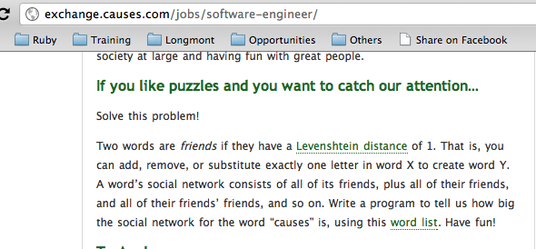
* So wrote my first serious program in Ruby.

!SLIDE bullets incremental
# The Reducibles Problem #
* 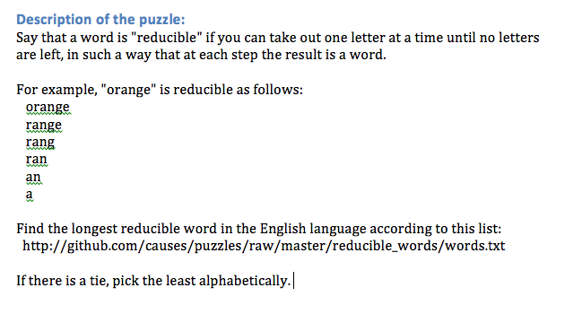

!SLIDE bullets incremental
# The Reward #
* Didn't get me the job at causes.com, but later on led to my current gig at Foraker Labs!

!SLIDE bullets incremental
# Moar Puzzles - Ruby Quiz! #

* 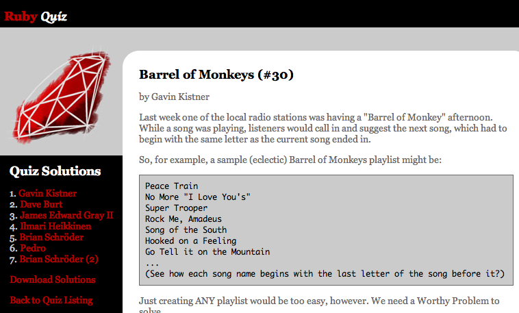

!SLIDE bullets incremental
# Even Moar Puzzles - Code Katas! #

* 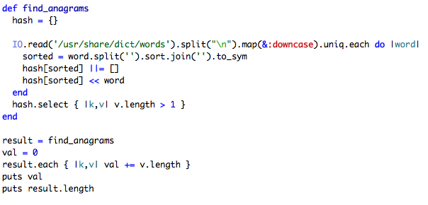

!SLIDE bullets incremental
# Project Euler - My favorite! #
* 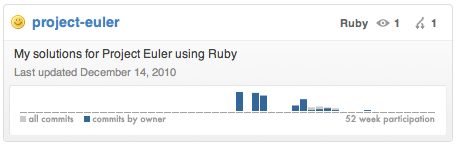

!SLIDE bullets incremental
# Commits #
* 
* 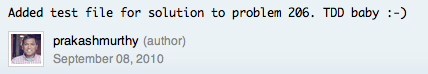
* 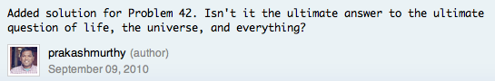

!SLIDE bullets incremental
# Moar Commits #
* 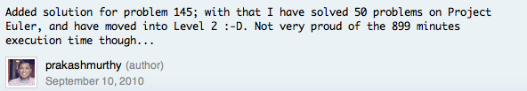
* 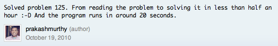
* 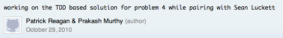

!SLIDE bullets incremental
# TDD with puzzles #
* 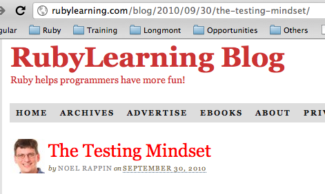

!SLIDE bullets incremental
# Counterpoint #
* 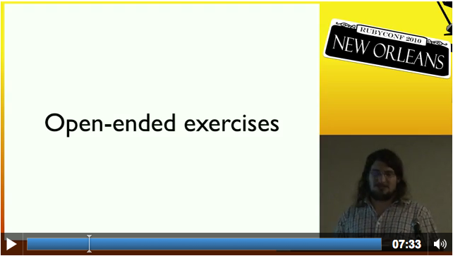

!SLIDE bullets incremental
# Resources #
* Project Euler http://projecteuler.net/
* Ruby Quiz http://www.rubyquiz.com
* Code Katas http://codekata.pragprog.com/
* Facebook Engineering Puzzles http://www.facebook.com/careers/puzzles.php

!SLIDE bullets incremental
# Resources - page 2 #
* Testing Mindset - Noel Rappin http://rubylearning.com/blog/2010/09/30/the-testing-mindset/

! Slide bullets incremental
# That's it! #

* Thank you!